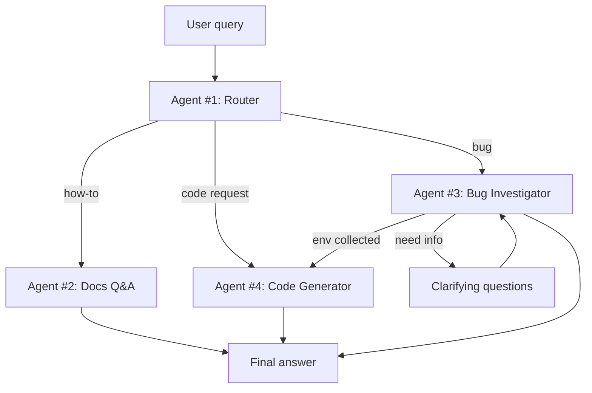

# Architecture

## Problem

<!-- 3-4 предложения от первого лица. Ориентиры:
     - какие типы тикетов реально прилетали в чат Crocoblock (how-to / баг / "напишите мне код")
     - почему у них разная механика обработки
     - почему один универсальный промпт с этим не справляется -->

## Agents

| Агент | Зона ответственности | Инструменты | Модель |
|---|---|---|---|
| #1 Router | Классифицирует запрос: how-to / bug / code / прочее. Отдаёт тип + confidence | — | Haiku (дёшево, быстро) |
| #2 Docs Q&A | Отвечает на how-to по документации JetEngine | Pinecone retrieval + Cohere rerank | Sonnet |
| #3 Bug Investigator | Задаёт уточняющие вопросы, собирает окружение с сайта | MCP: get_env_info, list_plugins, get_error_log | Sonnet |
| #4 Code Generator | Пишет PHP/CSS-фиксы под собранный контекст | MCP: get_env_info + валидатор синтаксиса | Sonnet |

## Flow

## State schema

| Поле | Тип | Кто пишет | Назначение |
|---|---|---|---|
| `messages` | list | все | История диалога |
| `query_type` | str | Router | how_to / bug / code / other |
| `confidence` | float | Router | Уверенность классификации; ниже порога — эскалация |
| `env_info` | dict | Bug Investigator | WP/PHP-версии, плагины, тема |
| `retrieved_docs` | list | Docs Q&A | Найденные фрагменты документации |
| `clarifying_rounds` | int | Bug Investigator | Счётчик вопросов, защита от бесконечного цикла |
| `final_answer` | str | Docs Q&A / Code Gen | Ответ пользователю |
| `needs_human` | bool | любой | Флаг эскалации на живого саппорта |

## Tech stack

- **Оркестрация:** LangGraph (conditional edges, `interrupt`, checkpointer)
- **LLM:** Anthropic Claude (основной), Google Gemini (dev-режим) — переключение через `LLM_PROVIDER`
- **Retrieval:** Pinecone + contextual retrieval + Cohere rerank
- **Интеграция с WordPress:** собственный MCP-сервер поверх WP REST API
