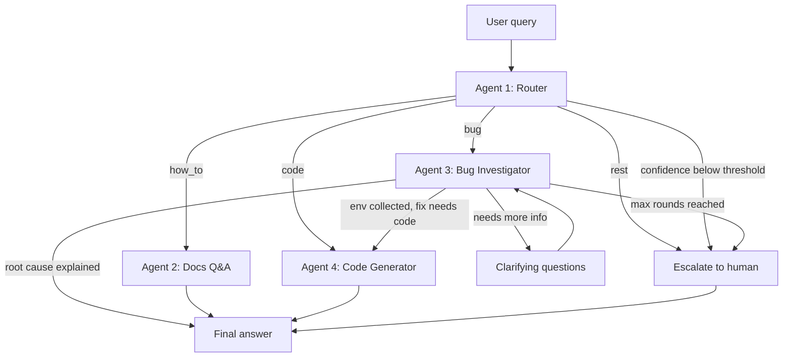

## Problem

I spent years on live-chat support for Crocoblock plugins (JetEngine,
JetFormBuilder, JetSmartFilters). This project automates the first line of that
work, so a human agent only handles what actually needs a human.

Based on that experience, client requests split into four groups:

- **how_to** — needs a precise answer grounded in current documentation.
  A plausible-but-wrong answer is worse than no answer at all: the client
  follows it, breaks something, and comes back frustrated.
- **bug** — a plugin doesn't work, or doesn't work as expected. Often it turns
  out not to be a bug at all, but the process is identical either way: ask a
  series of clarifying questions about the setup and, where possible, inspect
  the live site. In practice this meant 3-4 message round-trips before any
  diagnosis could even begin.
- **code** — functionality that can be solved with a few lines of PHP or CSS,
  extending what ships out of the box. The snippet must fit the client's actual
  environment, so it cannot be written before that environment is known.
- **rest** — anything outside the groups above: pre-sales questions, feature
  requests, feedback. No answer is expected here; it needs to reach a human.

A single prompt cannot serve all four. The agents need different tools
(documentation retrieval vs. live site access), different permissions
(read-only vs. writing code), and different success criteria (accuracy vs.
correct diagnostic questioning vs. timely escalation). Splitting them into
specialised agents keeps each prompt short and testable, and lets a small model
handle classification while only the hard cases reach a large one.

## Agents

| Agent | Responsibility | Tools | Model tier |
|---|---|---|---|
| #1 Router | Classifies the request into `how_to` / `bug` / `code` / `rest`. Returns type + confidence | — | Haiku (cheap, fast) |
| #2 Docs Q&A | Answers how-to questions from indexed plugin documentation | Pinecone retrieval + Cohere rerank | Sonnet |
| #3 Bug Investigator | Asks clarifying questions, collects environment data from the live site | MCP: `get_env_info`, `list_plugins`, `get_error_log` | Sonnet |
| #4 Code Generator | Writes PHP/CSS fixes against the collected context | MCP: `get_env_info` + syntax validator | Sonnet |

Exact model IDs live in `src/config.py`. The provider is switchable via
`LLM_PROVIDER`, so the same graph runs on Gemini during development.

**Scope of v1:** the documentation index covers JetEngine only. JetFormBuilder
and JetSmartFilters are additional namespaces in the same Pinecone index and
require no code changes to add.

## Flow

## State schema

| Field | Type | Written by | Purpose |
|---|---|---|---|
| `messages` | list | all | Conversation history |
| `query_type` | str | Router | `how_to` / `bug` / `code` / `rest` |
| `confidence` | float | Router | Classification certainty; below threshold → escalate |
| `env_info` | dict | Bug Investigator | WP/PHP versions, active plugins, theme |
| `retrieved_docs` | list | Docs Q&A | Retrieved documentation chunks |
| `clarifying_rounds` | int | Bug Investigator | Question counter; caps the loop at 3 rounds |
| `final_answer` | str | Docs Q&A / Code Generator | Response to the user |
| `needs_human` | bool | any | Escalation flag for a live support agent |

## Tech stack

- **Orchestration:** LangGraph — conditional edges, `interrupt` for
  human-in-the-loop questioning, checkpointer for conversation memory
- **LLM:** Anthropic Claude (primary), Google Gemini (development) — switched
  via a single `LLM_PROVIDER` variable
- **Retrieval:** Pinecone with contextual retrieval + Cohere reranking
- **WordPress integration:** custom MCP server over the WP REST API
