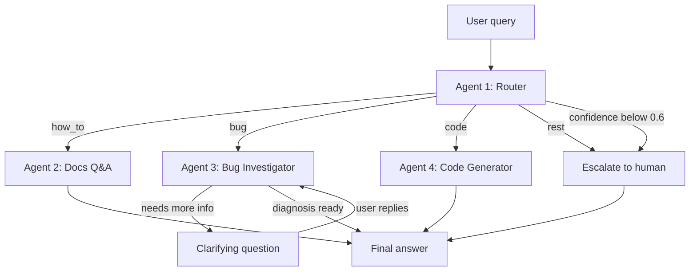

# Crocoblock AI Support Agent v2

A multi-agent system that handles first-line support for the JetFormBuilder
WordPress plugin: it classifies an incoming request, answers documentation
questions from a vector index, investigates bugs against a live WordPress
site, and writes PHP snippets — escalating to a human whenever it is not
confident enough.

Built with LangGraph. Runs on Anthropic Claude or Google Gemini, switched by a
single environment variable.

**Languages:** English · [Русский](README.ru.md) · [Українська](README.uk.md)

## Demo

**[▶ Watch the walkthrough (Loom)](https://www.loom.com/share/12bc143caf2d446288fef600a9506836)** — the four agents on a live
WordPress site, including the one scene that matters most: the code agent
declining to write a snippet for a hook that does not exist.

---

## Why this exists

I spent years on live-chat support for Crocoblock plugins. Most of that work is
not hard — it is repetitive triage. Requests fall into four groups, and each
needs a different kind of help:

| Type | What the customer wants | What it takes to answer |
|---|---|---|
| `how_to` | How to use an existing feature | An answer grounded in current docs. A plausible-but-wrong answer is worse than none. |
| `bug` | Something is broken | Clarifying questions plus a look at the actual site. Usually 3–4 message round-trips before diagnosis begins. |
| `code` | A snippet extending the plugin | Code that fits the customer's environment and uses hooks that really exist. |
| `rest` | Pricing, licensing, feature requests | A human. |

One prompt cannot serve all four. They need different tools, different
permissions, and different definitions of success. So each is a separate agent
with a short, testable prompt — and a cheap model does the triage while only
the hard cases reach an expensive one.

## How it works



| Agent | Responsibility | Tools | Model tier |
|---|---|---|---|
| **#1 Router** | Classifies into `how_to` / `bug` / `code` / `rest`, returns confidence | Structured output (Pydantic) | fast (Haiku) |
| **#2 Docs Q&A** | Answers from indexed documentation, cites source URLs | Pinecone search + Cohere rerank | smart (Sonnet) |
| **#3 Bug Investigator** | Asks clarifying questions, reads the live site's environment and error log | MCP: `get_env_info`, `list_plugins`, `get_error_log` | smart (Sonnet) |
| **#4 Code Generator** | Writes PHP/CSS snippets | Curated hook reference; reads `env_info` from state when available | smart (Sonnet) |

Three design decisions worth calling out:

**Confidence gating.** The router returns a score alongside the class. Below
0.6 the request goes straight to a human instead of to an agent that would
guess. Vague messages like *"it doesn't work"* or *"same problem as before"*
are supposed to fail this check, and they do.

**Human-in-the-loop, not a chat loop.** The Bug Investigator uses LangGraph's
`interrupt()`. The graph genuinely suspends mid-node, the question reaches the
user, and execution resumes from the checkpoint with the reply appended to
`investigation_log`. Capped at 2 rounds, after which it hands over with
`needs_human=True`.

**The code agent refuses to invent hooks.** Its prompt contains a curated
reference of verified JetFormBuilder hooks and instructs it to say so plainly
when a task needs something outside that list. Hallucinated hook names are the
single most expensive failure mode in plugin support — they look correct and
cost the customer an afternoon.

## Results

Measured by `tests/metrics.py`, raw output in [`metrics/results.json`](metrics/results.json).
Provider: Anthropic, `claude-haiku-4-5` for routing, `claude-sonnet-5` for the rest.

**Routing** — 25 labelled requests, phrased the way customers actually write:

| | Accuracy |
|---|---|
| Overall | **24/25 = 96%** (avg confidence 0.93) |
| `bug` | 7/7 |
| `how_to` | 6/6 |
| `rest` | 6/6 |
| `code` | 5/6 |

The one miss is a `code` request classified as `how_to` — an honest boundary
case, since the router is explicitly instructed to prefer `how_to` when a task
can be solved through built-in settings.

**Escalation** — 8 deliberately ambiguous messages: **7/8 fell below the
threshold** and were escalated. The failure is instructive: *"форма не
работает"* scored 0.75 and was confidently classified as a bug despite
containing no diagnostic information at all. The test set is otherwise in
English, so this is a reminder that confidence calibration is language-
dependent.

**Retrieval** — 10 questions with a known source page:

| Metric | Result |
|---|---|
| Hit@3 | 80% |
| Hit@5 | 90% |
| Average rank when found | 2.22 |

**Latency** — end-to-end, single request, no caching:

| Path | Time |
|---|---|
| Escalation | 1.2 s |
| Docs Q&A | 11.8 s |
| Code Generator | 22.9 s |
| Bug Investigator | 29.6 s to the first clarifying question |

The ordering tracks the work done: escalation is deterministic, Docs Q&A adds
two network round-trips to Cohere, code generation carries a long hook
reference in context, and the investigator calls MCP tools against a live site.

## Stack

- **Orchestration:** LangGraph — conditional edges, `interrupt()` for
  human-in-the-loop, `InMemorySaver` checkpointer for conversation memory
- **Models:** Anthropic Claude (primary), Google Gemini (development) — one
  `LLM_PROVIDER` variable switches both tiers
- **Retrieval:** 247 documentation pages → 1836 chunks (1000 chars, 150
  overlap) → Cohere `embed-v4.0` (1536 dim) → Pinecone index
  `jetformbuilder-docs`, namespace `jfb`. Search returns 20 candidates,
  Cohere `rerank-v3.5` narrows to 5.
- **WordPress integration:** a FastMCP server over the WP REST API, backed by a
  must-use plugin exposing `/env`, `/plugins`, and `/error-log`
- **Interfaces:** CLI and Streamlit, both on the same `src/runner.py`

## Getting started

Requires Python 3.12 and a WordPress site you control (Local by Flywheel works
well) with JetFormBuilder installed.

```bash
git clone https://github.com/igorshkov93/project-6-crocoblock-ai-support-agent-v2
cd project-6-crocoblock-ai-support-agent-v2

python -m venv .venv
.venv\Scripts\activate        # Windows
# source .venv/bin/activate   # macOS / Linux

pip install -r requirements.txt
cp .env.example .env          # then fill in your keys
```

Copy `src/mu-plugin/support-agent-api.php` into `wp-content/mu-plugins/` on the
target site, and create an application password for the WordPress user named in
`WP_APP_PASSWORD`.

Build the documentation index (once, ~15 minutes):

```bash
python -m src.rag.collect_urls
python -m src.rag.scrape_docs
python -m src.rag.chunk_docs
python -m src.rag.index_chunks
```

Then use it:

```bash
python -m src.cli "How do I redirect the user after submit?"
streamlit run app.py
```

Reproduce the numbers above:

```bash
python -m tests.metrics
```

## Repository layout

```
src/
  agents/          router, docs_qa, bug_investigator, code_generator
    knowledge/     curated JetFormBuilder hook reference
  rag/             scraping, chunking, indexing, two-stage retriever
  mcp_server/      FastMCP server + WP REST client
  mu-plugin/       WordPress must-use plugin exposing the sandbox endpoints
  graph.py         LangGraph assembly and routing logic
  state.py         SupportState schema
  runner.py        shared entry point for both interfaces
  cli.py           command-line interface
app.py             Streamlit chat interface
tests/             per-agent tests, labelled test sets, metrics suite
metrics/           measured results
```

Design decisions and the full state schema live in
[`ARCHITECTURE.md`](ARCHITECTURE.md).

## Known limits

- The index covers JetFormBuilder only. JetEngine and JetSmartFilters are
  additional namespaces in the same Pinecone index and need no code changes.
- `InMemorySaver` keeps conversation state in process memory: restarting the
  app clears every thread. Swapping in a persistent checkpointer is a
  configuration change, not a rewrite.
- Confidence calibration is weaker for non-English messages, as the escalation
  results show.
- The Bug Investigator reads the site but never writes to it. Every MCP tool is
  read-only by design.
