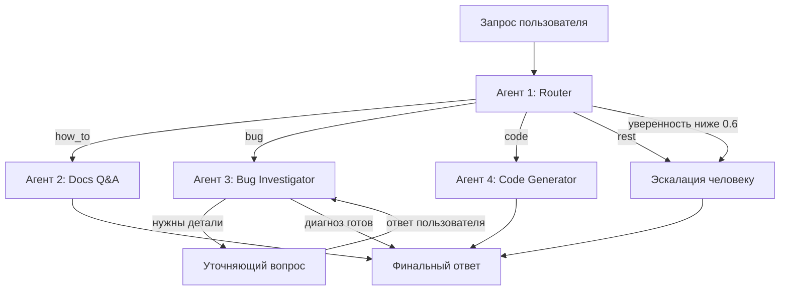

# Crocoblock AI Support Agent v2

Мультиагентная система для первой линии поддержки WordPress-плагина
JetFormBuilder: классифицирует обращение, отвечает на вопросы по документации
из векторного индекса, расследует баги на живом сайте и пишет PHP-сниппеты — а
когда уверенности не хватает, передаёт тикет человеку.

Построено на LangGraph. Работает на Anthropic Claude или Google Gemini —
переключение одной переменной окружения.

**Языки:** [English](README.md) · Русский · [Українська](README.uk.md)

---

## Зачем это

Я несколько лет работал в live-чате поддержки плагинов Crocoblock. Основная
часть этой работы не сложная — она повторяющаяся. Обращения делятся на четыре
группы, и каждой нужна своя помощь:

| Тип | Что хочет клиент | Что нужно для ответа |
|---|---|---|
| `how_to` | Как пользоваться существующей функцией | Ответ, опирающийся на актуальную документацию. Правдоподобный, но неверный ответ хуже, чем никакой. |
| `bug` | Что-то не работает | Уточняющие вопросы плюс взгляд на сам сайт. Обычно 3–4 круга переписки до начала диагностики. |
| `code` | Сниппет, расширяющий плагин | Код под реальное окружение клиента и на хуках, которые действительно существуют. |
| `rest` | Цены, лицензии, пожелания к функционалу | Человек. |

Один промпт не покроет все четыре. Им нужны разные инструменты, разные права и
разные критерии успеха. Поэтому каждый — отдельный агент с коротким и
проверяемым промптом, а сортировкой занимается дешёвая модель: до дорогой
доходят только сложные случаи.

## Как это работает



| Агент | Задача | Инструменты | Тир модели |
|---|---|---|---|
| **#1 Router** | Классифицирует в `how_to` / `bug` / `code` / `rest`, возвращает уверенность | Structured output (Pydantic) | fast (Haiku) |
| **#2 Docs Q&A** | Отвечает по индексированной документации, ссылается на источники | Поиск в Pinecone + реранк Cohere | smart (Sonnet) |
| **#3 Bug Investigator** | Задаёт уточняющие вопросы, читает окружение и лог ошибок живого сайта | MCP: `get_env_info`, `list_plugins`, `get_error_log` | smart (Sonnet) |
| **#4 Code Generator** | Пишет PHP/CSS-сниппеты | Выверенный справочник хуков; берёт `env_info` из стейта, если он собран | smart (Sonnet) |

Три решения, которые стоит выделить отдельно.

**Порог уверенности.** Роутер возвращает не только класс, но и оценку. Ниже 0.6
обращение уходит сразу к человеку, а не к агенту, который начнёт гадать.
Расплывчатые сообщения вроде «не работает» или «та же проблема, что и раньше»
должны эту проверку заваливать — и заваливают.

**Human-in-the-loop, а не цикл в чате.** Bug Investigator использует
`interrupt()` из LangGraph. Граф действительно приостанавливается посреди узла,
вопрос доходит до пользователя, а выполнение возобновляется с чекпоинта, дописав
ответ в `investigation_log`. Лимит — 2 круга, после чего тикет передаётся
человеку с `needs_human=True`.

**Кодовый агент не выдумывает хуки.** В его промпте лежит выверенный справочник
подтверждённых хуков JetFormBuilder и указание прямо сказать, если задача
требует чего-то за пределами этого списка. Придуманные имена хуков — самый
дорогой тип ошибки в поддержке плагинов: выглядят правильно и стоят клиенту
половины рабочего дня.

## Результаты

Замерено через `tests/metrics.py`, сырой вывод — в
[`metrics/results.json`](metrics/results.json). Провайдер Anthropic,
`claude-haiku-4-5` на роутинге, `claude-sonnet-5` на остальном.

**Роутинг** — 25 размеченных обращений, сформулированных так, как реально пишут
клиенты:

| | Точность |
|---|---|
| Всего | **24/25 = 96%** (средняя уверенность 0.93) |
| `bug` | 7/7 |
| `how_to` | 6/6 |
| `rest` | 6/6 |
| `code` | 5/6 |

Единственная ошибка — запрос типа `code`, отнесённый к `how_to`. Это честный
пограничный случай: роутеру прямо предписано выбирать `how_to`, когда задача
решается штатными настройками.

**Эскалация** — 8 намеренно неоднозначных сообщений: **7/8 не дотянули до
порога** и ушли человеку. Промах показателен: «форма не работает» получила 0.75
и была уверенно классифицирована как баг, хотя диагностической информации там
ноль. Остальной набор на английском — то есть калибровка уверенности зависит от
языка.

**Поиск по документации** — 10 вопросов с заранее известной страницей-источником:

| Метрика | Результат |
|---|---|
| Hit@3 | 80% |
| Hit@5 | 90% |
| Средняя позиция при попадании | 2.22 |

**Задержка** — сквозной прогон, один запрос, без кэша:

| Путь | Время |
|---|---|
| Эскалация | 1.2 с |
| Docs Q&A | 11.8 с |
| Code Generator | 22.9 с |
| Bug Investigator | 29.6 с до первого уточняющего вопроса |

Порядок повторяет объём работы: эскалация детерминирована, Docs Q&A добавляет
два сетевых обращения к Cohere, генерация кода тащит в контексте длинный
справочник хуков, а расследование дёргает MCP-инструменты на живом сайте.

## Стек

- **Оркестрация:** LangGraph — условные рёбра, `interrupt()` для
  human-in-the-loop, чекпоинтер `InMemorySaver` для памяти диалога
- **Модели:** Anthropic Claude (основной), Google Gemini (разработка) — одна
  переменная `LLM_PROVIDER` переключает оба тира
- **Retrieval:** 247 страниц документации → 1836 чанков (1000 символов,
  перекрытие 150) → Cohere `embed-v4.0` (1536 измерений) → индекс Pinecone
  `jetformbuilder-docs`, namespace `jfb`. Поиск отдаёт 20 кандидатов, Cohere
  `rerank-v3.5` сужает до 5.
- **Интеграция с WordPress:** сервер FastMCP поверх WP REST API, опирающийся на
  mu-plugin с эндпоинтами `/env`, `/plugins` и `/error-log`
- **Интерфейсы:** CLI и Streamlit, оба поверх общего `src/runner.py`

## Запуск

Нужны Python 3.12 и подконтрольный WordPress-сайт (удобно Local by Flywheel) с
установленным JetFormBuilder.

```bash
git clone https://github.com/igorshkov93/project-6-crocoblock-ai-support-agent-v2
cd project-6-crocoblock-ai-support-agent-v2

python -m venv .venv
.venv\Scripts\activate        # Windows
# source .venv/bin/activate   # macOS / Linux

pip install -r requirements.txt
cp .env.example .env          # затем заполнить ключи
```

Скопируйте `src/mu-plugin/support-agent-api.php` в `wp-content/mu-plugins/` на
целевом сайте и создайте application password для пользователя WordPress,
указанного в `WP_APP_PASSWORD`.

Соберите индекс документации (один раз, ~15 минут):

```bash
python -m src.rag.collect_urls
python -m src.rag.scrape_docs
python -m src.rag.chunk_docs
python -m src.rag.index_chunks
```

Дальше можно пользоваться:

```bash
python -m src.cli "How do I redirect the user after submit?"
streamlit run app.py
```

Воспроизвести цифры выше:

```bash
python -m tests.metrics
```

## Структура репозитория

```
src/
  agents/          router, docs_qa, bug_investigator, code_generator
    knowledge/     выверенный справочник хуков JetFormBuilder
  rag/             скрейпинг, чанкинг, индексация, двухэтапный ретривер
  mcp_server/      сервер FastMCP + клиент WP REST
  mu-plugin/       mu-plugin WordPress с эндпоинтами песочницы
  graph.py         сборка графа LangGraph и логика маршрутизации
  state.py         схема SupportState
  runner.py        общая точка входа для обоих интерфейсов
  cli.py           интерфейс командной строки
app.py             чат-интерфейс на Streamlit
tests/             тесты агентов, размеченные наборы, набор метрик
metrics/           измеренные результаты
```

Проектные решения и полная схема стейта — в
[`ARCHITECTURE.md`](ARCHITECTURE.md).

## Известные ограничения

- Индекс покрывает только JetFormBuilder. JetEngine и JetSmartFilters — это
  дополнительные namespace в том же индексе Pinecone, менять код не нужно.
- `InMemorySaver` держит состояние диалога в памяти процесса: перезапуск
  приложения стирает все треды. Замена на постоянный чекпоинтер — это правка
  конфигурации, а не переписывание.
- Калибровка уверенности слабее на неанглийских сообщениях, что и показали
  результаты по эскалации.
- Bug Investigator только читает сайт и никогда в него не пишет. Все
  MCP-инструменты доступны исключительно на чтение — так задумано.
