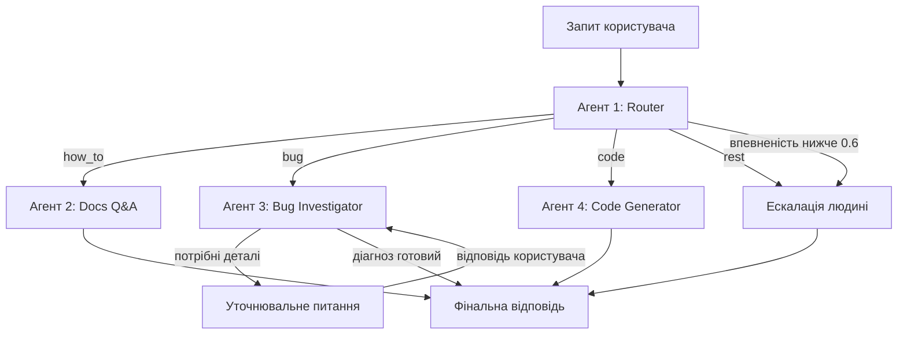

# Crocoblock AI Support Agent v2

Мультиагентна система для першої лінії підтримки WordPress-плагіна
JetFormBuilder: класифікує звернення, відповідає на питання за документацією з
векторного індексу, розслідує баги на живому сайті та пише PHP-сніпети — а коли
впевненості бракує, передає тікет людині.

Побудовано на LangGraph. Працює на Anthropic Claude або Google Gemini —
перемикання однією змінною середовища.

**Мови:** [English](README.md) · [Русский](README.ru.md) · Українська

---

## Навіщо це

Я кілька років працював у live-чаті підтримки плагінів Crocoblock. Основна
частина цієї роботи не складна — вона повторювана. Звернення діляться на чотири
групи, і кожній потрібна своя допомога:

| Тип | Чого хоче клієнт | Що потрібно для відповіді |
|---|---|---|
| `how_to` | Як користуватися наявною функцією | Відповідь, що спирається на актуальну документацію. Правдоподібна, але хибна відповідь гірша за жодну. |
| `bug` | Щось не працює | Уточнювальні питання плюс погляд на сам сайт. Зазвичай 3–4 кола листування до початку діагностики. |
| `code` | Сніпет, що розширює плагін | Код під реальне оточення клієнта і на хуках, які справді існують. |
| `rest` | Ціни, ліцензії, побажання щодо функціоналу | Людина. |

Один промпт не покриє всі чотири. Їм потрібні різні інструменти, різні права та
різні критерії успіху. Тому кожен — окремий агент з коротким і перевірюваним
промптом, а сортуванням займається дешева модель: до дорогої доходять лише
складні випадки.

## Як це працює



| Агент | Завдання | Інструменти | Тир моделі |
|---|---|---|---|
| **#1 Router** | Класифікує у `how_to` / `bug` / `code` / `rest`, повертає впевненість | Structured output (Pydantic) | fast (Haiku) |
| **#2 Docs Q&A** | Відповідає за індексованою документацією, посилається на джерела | Пошук у Pinecone + реранк Cohere | smart (Sonnet) |
| **#3 Bug Investigator** | Ставить уточнювальні питання, читає оточення та лог помилок живого сайту | MCP: `get_env_info`, `list_plugins`, `get_error_log` | smart (Sonnet) |
| **#4 Code Generator** | Пише PHP/CSS-сніпети | Вивірений довідник хуків; бере `env_info` зі стейту, якщо він зібраний | smart (Sonnet) |

Три рішення, які варто виділити окремо.

**Поріг впевненості.** Роутер повертає не лише клас, а й оцінку. Нижче 0.6
звернення йде одразу до людини, а не до агента, який почне вгадувати. Розпливчаті
повідомлення на кшталт «не працює» або «та сама проблема, що й раніше» мають цю
перевірку провалювати — і провалюють.

**Human-in-the-loop, а не цикл у чаті.** Bug Investigator використовує
`interrupt()` з LangGraph. Граф справді призупиняється посеред вузла, питання
доходить до користувача, а виконання відновлюється з чекпоінта, дописавши
відповідь до `investigation_log`. Ліміт — 2 кола, після чого тікет передається
людині з `needs_human=True`.

**Кодовий агент не вигадує хуки.** У його промпті лежить вивірений довідник
підтверджених хуків JetFormBuilder і вказівка прямо сказати, якщо задача
потребує чогось поза цим списком. Вигадані імена хуків — найдорожчий тип помилки
в підтримці плагінів: виглядають правильно і коштують клієнту половини робочого
дня.

## Результати

Заміряно через `tests/metrics.py`, сирий вивід — у
[`metrics/results.json`](metrics/results.json). Провайдер Anthropic,
`claude-haiku-4-5` на роутингу, `claude-sonnet-5` на решті.

**Роутинг** — 25 розмічених звернень, сформульованих так, як реально пишуть
клієнти:

| | Точність |
|---|---|
| Разом | **24/25 = 96%** (середня впевненість 0.93) |
| `bug` | 7/7 |
| `how_to` | 6/6 |
| `rest` | 6/6 |
| `code` | 5/6 |

Єдина помилка — запит типу `code`, віднесений до `how_to`. Це чесний межовий
випадок: роутеру прямо приписано обирати `how_to`, коли задача розв'язується
штатними налаштуваннями.

**Ескалація** — 8 навмисно неоднозначних повідомлень: **7/8 не дотягнули до
порогу** й пішли до людини. Промах показовий: «форма не работает» отримала 0.75
і була впевнено класифікована як баг, хоча діагностичної інформації там нуль.
Решта набору англійською — тобто калібрування впевненості залежить від мови.

**Пошук за документацією** — 10 питань із заздалегідь відомою сторінкою-джерелом:

| Метрика | Результат |
|---|---|
| Hit@3 | 80% |
| Hit@5 | 90% |
| Середня позиція при влучанні | 2.22 |

**Затримка** — наскрізний прогін, один запит, без кешу:

| Шлях | Час |
|---|---|
| Ескалація | 1.2 с |
| Docs Q&A | 11.8 с |
| Code Generator | 22.9 с |
| Bug Investigator | 29.6 с до першого уточнювального питання |

Порядок повторює обсяг роботи: ескалація детермінована, Docs Q&A додає два
мережеві звернення до Cohere, генерація коду тягне в контексті довгий довідник
хуків, а розслідування смикає MCP-інструменти на живому сайті.

## Стек

- **Оркестрація:** LangGraph — умовні ребра, `interrupt()` для
  human-in-the-loop, чекпоінтер `InMemorySaver` для пам'яті діалогу
- **Моделі:** Anthropic Claude (основний), Google Gemini (розробка) — одна
  змінна `LLM_PROVIDER` перемикає обидва тири
- **Retrieval:** 247 сторінок документації → 1836 чанків (1000 символів,
  перекриття 150) → Cohere `embed-v4.0` (1536 вимірів) → індекс Pinecone
  `jetformbuilder-docs`, namespace `jfb`. Пошук віддає 20 кандидатів, Cohere
  `rerank-v3.5` звужує до 5.
- **Інтеграція з WordPress:** сервер FastMCP поверх WP REST API, що спирається
  на mu-plugin з ендпоінтами `/env`, `/plugins` та `/error-log`
- **Інтерфейси:** CLI і Streamlit, обидва поверх спільного `src/runner.py`

## Запуск

Потрібні Python 3.12 та підконтрольний WordPress-сайт (зручно Local by
Flywheel) зі встановленим JetFormBuilder.

```bash
git clone https://github.com/igorshkov93/project-6-crocoblock-ai-support-agent-v2
cd project-6-crocoblock-ai-support-agent-v2

python -m venv .venv
.venv\Scripts\activate        # Windows
# source .venv/bin/activate   # macOS / Linux

pip install -r requirements.txt
cp .env.example .env          # потім заповнити ключі
```

Скопіюйте `src/mu-plugin/support-agent-api.php` до `wp-content/mu-plugins/` на
цільовому сайті та створіть application password для користувача WordPress,
зазначеного в `WP_APP_PASSWORD`.

Зберіть індекс документації (один раз, ~15 хвилин):

```bash
python -m src.rag.collect_urls
python -m src.rag.scrape_docs
python -m src.rag.chunk_docs
python -m src.rag.index_chunks
```

Далі можна користуватися:

```bash
python -m src.cli "How do I redirect the user after submit?"
streamlit run app.py
```

Відтворити цифри вище:

```bash
python -m tests.metrics
```

## Структура репозиторію

```
src/
  agents/          router, docs_qa, bug_investigator, code_generator
    knowledge/     вивірений довідник хуків JetFormBuilder
  rag/             скрейпінг, чанкінг, індексація, двоетапний ретривер
  mcp_server/      сервер FastMCP + клієнт WP REST
  mu-plugin/       mu-plugin WordPress з ендпоінтами пісочниці
  graph.py         збірка графа LangGraph і логіка маршрутизації
  state.py         схема SupportState
  runner.py        спільна точка входу для обох інтерфейсів
  cli.py           інтерфейс командного рядка
app.py             чат-інтерфейс на Streamlit
tests/             тести агентів, розмічені набори, набір метрик
metrics/           виміряні результати
```

Проєктні рішення та повна схема стейту — в
[`ARCHITECTURE.md`](ARCHITECTURE.md).

## Відомі обмеження

- Індекс покриває лише JetFormBuilder. JetEngine і JetSmartFilters — це
  додаткові namespace у тому самому індексі Pinecone, змінювати код не потрібно.
- `InMemorySaver` тримає стан діалогу в пам'яті процесу: перезапуск застосунку
  стирає всі треди. Заміна на постійний чекпоінтер — це правка конфігурації, а
  не переписування.
- Калібрування впевненості слабше на неанглійських повідомленнях, що й показали
  результати щодо ескалації.
- Bug Investigator лише читає сайт і ніколи в нього не пише. Усі
  MCP-інструменти доступні виключно на читання — так задумано.
